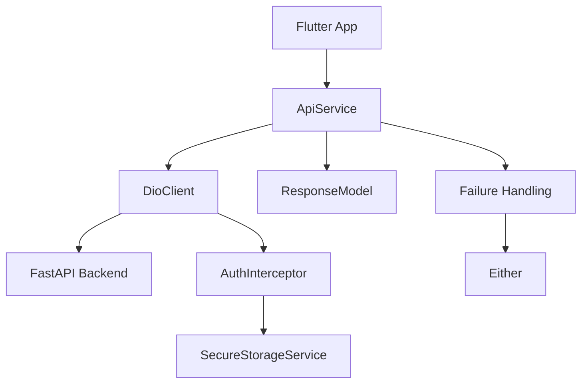

# Flutter API Integration Plan

## Project Overview

GlucoTrack is a Flutter application for diabetes management with backend API endpoints built using FastAPI. The current codebase has inconsistent API integration due to duplicate ApiService implementations and varying error handling approaches.

## Current Issues

### 1. Duplicate ApiService Classes

- `core/api/api_service.dart`: Simple CRUD operations with basic error handling
- `core/helperfile/api_service.dart`: Generic API service with ResponseModel pattern
- Different features use different ApiService implementations

### 2. Inconsistent Error Handling

- Auth & User: Manual exception handling with ApiError
- Chat: ResponseModel with Either<Failure, T>
- Archive: Minimal error handling

### 3. Token Management

- `core/api/dio_client.dart`: Uses PrefHelper for token storage
- `core/helperfile/dio_client.dart`: Uses SecureStorageService for token storage

### 4. Missing API Methods

- Some API endpoints defined in ApiEndpoints are not implemented in ApiService

## Plan Objectives

1. Create a single, unified ApiService following the ResponseModel pattern
2. Standardize error handling across all features
3. Implement consistent token management
4. Add missing API methods
5. Update all repositories to use the unified ApiService
6. Fix any remaining errors

## Implementation Steps

### Step 1: Refactor ApiService (Unification)

**File: `frontend/lib/core/api/api_service.dart`**

- Replace the simple CRUD ApiService with the ResponseModel-based implementation from helperfile
- Add missing API methods for all endpoints defined in ApiEndpoints
- Ensure all methods use ResponseModel<T> for consistent error handling

### Step 2: Update DioClient Configuration

**File: `frontend/lib/core/api/dio_client.dart`**

- Remove duplicate DioClient in helperfile
- Implement singleton pattern
- Use consistent base URL from helperfile (http://192.168.251.59:8000)
- Add PrettyDioLogger for debugging
- Implement AuthInterceptor with token management
- Use SecureStorageService for token storage (consistent across app)

### Step 3: Update ApiEndpoints

**File: `frontend/lib/core/api/end_point.dart`**

- Ensure all backend endpoints are properly defined
- Add any missing endpoints
- Verify consistency with backend FastAPI routes

### Step 4: Update Repositories

**Files:**

- `frontend/lib/features/auth/repo/auth_repo_impl.dart`
- `frontend/lib/features/user/repo/user_repo_impl.dart`
- `frontend/lib/features/chat/repo/chat_repo_impl.dart`
- `frontend/lib/features/archives/repo/archive_repo_impl.dart`

- Update all repositories to use the unified ApiService
- Standardize error handling using Either<Failure, T> pattern
- Fix any type safety issues

### Step 5: Fix Token Management

**File: `frontend/lib/core/utils/pref_helper.dart`**

- Either: Update to use SecureStorageService consistently
- Or: Implement a wrapper that uses both (deprecated approach)

### Step 6: Add Missing API Methods

**File: `frontend/lib/core/api/api_service.dart`**

Add missing methods for:

- User endpoints (create, get, update)
- Risk endpoints (create, get, update, delete)
- Meal endpoints (create, get)
- Analysis endpoints (get all, delete)
- OTP endpoints (check, forgot password, verify, reset)

### Step 7: Test Integration

- Run the app to verify API integration
- Test all features: Auth, User, Chat, Archives, Risk, Meal
- Verify token management and error handling
- Fix any issues found during testing

## Architecture Diagram

## Expected Outcome

After implementation:

- Single unified ApiService for all API calls
- Consistent error handling across all features
- Reliable token management
- All API endpoints properly linked to Flutter
- Codebase follows clean architecture principles
- No duplicate code or inconsistent implementations

## Risk Assessment

| Risk                                       | Impact | Mitigation                            |
| ------------------------------------------ | ------ | ------------------------------------- |
| Breaking changes to existing functionality | High   | Test thoroughly before implementation |
| Token storage migration issues             | Medium | Implement backwards compatibility     |
| API endpoint inconsistencies               | Medium | Verify endpoints with backend team    |

## Timeline

- **Phase 1: ApiService & DioClient refactor** - 1-2 days
- **Phase 2: Repository updates** - 1 day
- **Phase 3: Testing & bug fixes** - 1 day
- **Total: 3-4 days**
