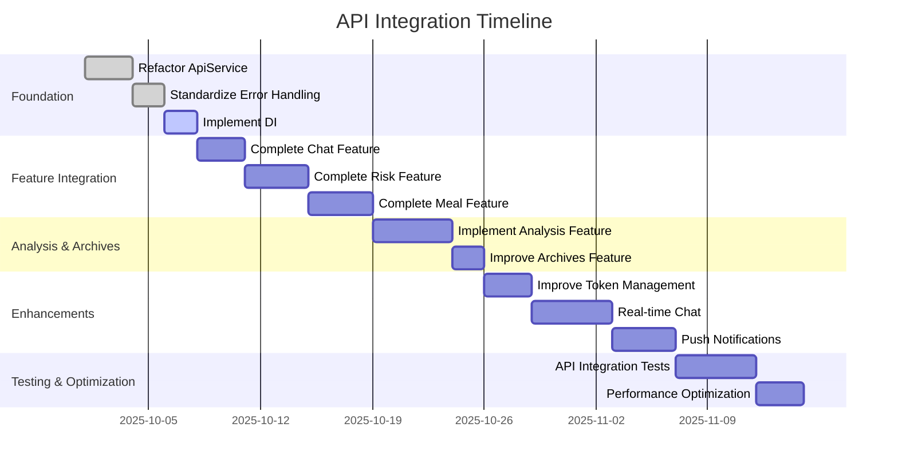

# API Integration Plan: Flutter with FastAPI Backend

## Project Overview

GlucoTrack is a Flutter application for diabetes management with FastAPI backend. This plan outlines the steps to implement and link API endpoints between the frontend and backend.

## Current Architecture Analysis

### Existing Issues

1. **Duplicate ApiService Classes**: Two implementations exist (`core/api/api_service.dart` and `core/helperfile/api_service.dart`) causing inconsistency
2. **Inconsistent Error Handling**: Different approaches across features (Auth & User use manual handling, Chat uses ResponseModel with Either<Failure, T>)
3. **Manual Dependency Injection**: Tight coupling in main.dart with duplicate ApiService instances
4. **Missing Methods**: ChatRepositoryImpl references missing methods in ApiService
5. **Partial Implementations**: Risk management and meal tracking have only API endpoints defined

## Plan Objectives

1. Create a unified API service layer
2. Standardize error handling across all features
3. Implement proper dependency injection
4. Complete API integration for all features
5. Ensure type safety and consistency

## Implementation Plan

### Phase 1: Foundation (Critical)

#### 1.1 Refactor ApiService - Create Single Unified Implementation

- **File**: `frontend/lib/core/api/api_service.dart`
- **Action**: Replace duplicate ApiService classes with one unified implementation
- **Changes**:
  - Keep the generic ResponseModel approach from helperfile version
  - Add all missing methods from both implementations
  - Ensure type safety with proper type parameters

#### 1.2 Standardize Error Handling

- **File**: `frontend/lib/core/errors/failure.dart`
- **Action**: Create unified Failure classes for consistent error handling
- **Changes**:
  - Define specific failure types (ServerFailure, NetworkFailure, CacheFailure, etc.)
  - Update ApiService to use Either<Failure, T> pattern
  - Ensure all features handle errors uniformly

#### 1.3 Implement Dependency Injection

- **File**: `frontend/pubspec.yaml`, `frontend/lib/core/injection_container.dart`
- **Action**: Add get_it package for service locator pattern
- **Changes**:
  - Add `get_it` and `injectable` dependencies
  - Create injection container for managing dependencies
  - Replace manual injection in main.dart

### Phase 2: Feature Integration (High Priority)

#### 2.1 Complete Chat Feature API Integration

- **Files**: `frontend/lib/features/chat/repo/chat_repo_impl.dart`, `frontend/lib/core/api/api_service.dart`
- **Action**: Fix missing methods in ApiService referenced by ChatRepositoryImpl
- **Changes**:
  - Add all required chat methods to unified ApiService
  - Update ChatRepositoryImpl to use new ApiService
  - Test chat functionality

#### 2.2 Complete Risk Management Feature

- **Files**: `frontend/lib/features/risk/` (create if missing)
- **Action**: Implement risk management feature with API integration
- **Changes**:
  - Create risk data models
  - Implement risk repository and cubit
  - Create risk presentation layer
  - Link to FastAPI endpoints

#### 2.3 Complete Meal Tracking Feature

- **Files**: `frontend/lib/features/meal/` (create if missing)
- **Action**: Implement meal tracking feature with API integration
- **Changes**:
  - Create meal data models
  - Implement meal repository and cubit
  - Create meal presentation layer
  - Link to FastAPI endpoints

### Phase 3: Analysis & Archives (Medium Priority)

#### 3.1 Implement Analysis Retrieval

- **Files**: `frontend/lib/features/analysis/` (create if missing)
- **Action**: Implement analysis retrieval feature
- **Changes**:
  - Create analysis data models
  - Implement analysis repository and cubit
  - Create analysis presentation layer
  - Link to FastAPI endpoints

#### 3.2 Improve Archives Feature API Integration

- **Files**: `frontend/lib/features/archives/repo/archive_repo_impl.dart`
- **Action**: Update archives feature to use unified ApiService
- **Changes**:
  - Replace direct Dio usage with ApiService
  - Improve error handling in archives feature

### Phase 4: Enhancements (Low Priority)

#### 4.1 Improve Token Management

- **File**: `frontend/lib/core/api/auth_interceptor.dart`
- **Action**: Enhance token management with Dio interceptor
- **Changes**:
  - Implement token refresh logic
  - Improve authentication error handling
  - Add token validation checks

#### 4.2 Add Real-time Chat Functionality

- **Files**: `frontend/lib/features/chat/`
- **Action**: Implement WebSocket-based real-time chat
- **Changes**:
  - Add WebSocket support
  - Implement real-time message handling
  - Update chat UI for real-time updates

#### 4.3 Implement Push Notifications

- **Files**: `frontend/lib/core/utils/`
- **Action**: Add push notification support
- **Changes**:
  - Configure push notification services
  - Implement notification handling
  - Add notification UI components

### Phase 5: Testing & Optimization

#### 5.1 Write API Integration Tests

- **Files**: `frontend/test/api/`
- **Action**: Create comprehensive API integration tests
- **Changes**:
  - Test all API endpoints
  - Test error handling scenarios
  - Test authentication and token management

#### 5.2 Performance Optimization

- **Files**: All relevant files
- **Action**: Optimize API calls and data handling
- **Changes**:
  - Implement caching strategies
  - Optimize network requests
  - Add loading states and pull-to-refresh

## API Endpoints to Implement

### Auth Endpoints

- ✅ POST `/auth/login` - User login
- ✅ POST `/auth/logout` - User logout

### User Endpoints

- ✅ POST `/user/` - Create user
- ✅ GET `/user/` - Get current user
- ✅ PUT `/user/update` - Update user
- ✅ GET `/user/{id}` - Get user by ID

### Bot Conversation Endpoints

- ✅ POST `/bot/conversation` - Create conversation
- ✅ GET `/bot/conversation/{id}` - Get conversation
- ✅ GET `/bot/conversation/all/{userId}` - Get all conversations
- ✅ DELETE `/bot/conversation/{id}` - Delete conversation

### Bot Message Endpoints

- ✅ POST `/bot/message` - Create message
- ✅ GET `/bot/message/all/{convId}` - Get all messages

### Risk Endpoints

- ✅ POST `/risk/` - Create risk
- ✅ GET `/risk/{id}` - Get risk
- ✅ PUT `/risk/{id}` - Update risk
- ✅ DELETE `/risk/{id}` - Delete risk

### Meal Endpoints

- ✅ POST `/meal/` - Create meal
- ✅ GET `/meal/{id}` - Get meal

### Analysis Endpoints

- ❌ GET `/analyse/all/{id}` - Get all analysis
- ❌ DELETE `/analyse/{id}` - Delete analysis

### OTP Endpoints

- ✅ GET `/otp/check` - OTP check
- ✅ POST `/otp/forgot-password` - Forgot password
- ✅ POST `/otp/verify-otp` - Verify OTP
- ✅ POST `/otp/reset-password` - Reset password

## Dependencies to Add

### Core Dependencies

- `get_it: ^7.6.0` - Dependency injection
- `injectable: ^2.3.0` - Code generation for get_it
- `dio: ^5.4.0` - HTTP client (already present)
- `pretty_dio_logger: ^1.3.1` - Dio logger (already present)

### Development Dependencies

- `build_runner: ^2.4.0` - Code generation
- `injectable_generator: ^2.4.0` - For injectable

## Timeline & Prioritization

## Success Criteria

- All API endpoints are implemented and tested
- No duplicate ApiService implementations
- Consistent error handling across all features
- Proper dependency injection with get_it
- All features (auth, user, chat, risk, meal, analysis, archives) are fully integrated
- Comprehensive test coverage for API integration
- Performance optimizations implemented

## Risks & Mitigation

1. **API Changes**: Backend endpoints may change during implementation
   - Mitigation: Maintain close communication with backend team, use API versioning

2. **Network Issues**: Flaky network connections may affect testing
   - Mitigation: Implement retry logic, add offline support with caching

3. **Authentication**: Token management complexity
   - Mitigation: Use secure storage, implement token refresh logic

## Conclusion

This plan provides a structured approach to integrate all FastAPI endpoints with the Flutter application. By following this plan, we will achieve a consistent, maintainable, and scalable API integration layer that supports all features of the GlucoTrack application.
